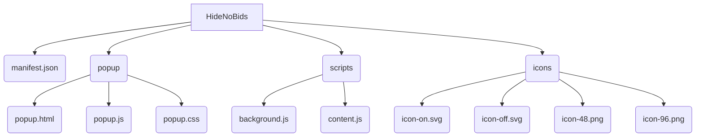

# Project Structure Plan: `HideNoBids`

This plan outlines the necessary files and their roles for the 'HideNoBids' Firefox extension.

### File Descriptions

*   **`manifest.json`**: The core of the extension. It will define the name, version, permissions, and declare the paths for the background script, content scripts, and popup UI.
*   **`popup/popup.html`**: This file will define the structure of the popup window, which includes the on/off toggle switch and the 'Rate Me' button.
*   **`popup/popup.js`**: This script will handle all user interactions within the popup. It will manage the state of the toggle, save preferences, and handle the 'Rate Me' button's click event. It will also communicate with `scripts/background.js` to pass state changes.
*   **`popup/popup.css`**: This will style the popup's elements for a clean and intuitive user interface.
*   **`scripts/background.js`**: This script will be the extension's event handler. It will manage the on/off state of the extension, listen for updates from the popup, and control the swapping of the toolbar icon.
*   **`scripts/content.js`**: This script will be injected directly into eBay pages. It will be responsible for finding and hiding the listings that have zero bids.
*   **`icons/` directory**: This will contain the icons for the extension.
    *   `icon-on.svg`: To be shown when the extension is active.
    *   `icon-off.svg`: To be shown when the extension is disabled.
    *   `icon-48.png` & `icon-96.png`: Standard icon sizes for the extension management page and high-resolution displays.